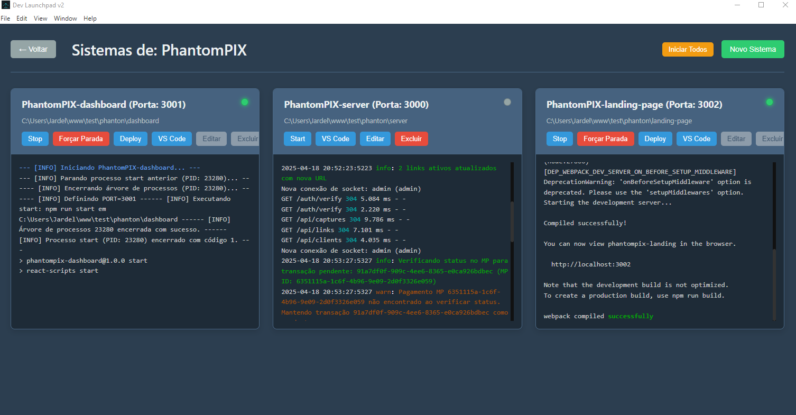

# Dev Launchpad v2.0.0

Um painel centralizado para gerenciar e agilizar o fluxo de trabalho de desenvolvimento de múltiplas aplicações e seus sistemas (start/stop/deploy).

 <!-- Você pode querer substituir 'icon.png' pelo caminho correto ou URL se hospedado -->

## O Problema

Desenvolvedores frequentemente trabalham com arquiteturas complexas, como microsserviços, ou múltiplos projetos relacionados (backend, frontend, workers). Gerenciar o ciclo de vida de cada componente individualmente pode ser desafiador:

- Abrir e gerenciar múltiplas janelas de terminal.
- Lembrar ou procurar os diretórios corretos para cada serviço.
- Digitar repetidamente comandos de inicialização (`npm start`, `docker-compose up`, etc.).
- Manter o controle das portas usadas por cada serviço.
- Executar comandos de deploy para diferentes ambientes.
- Monitorar logs dispersos em várias janelas.
- Encerrar processos corretamente, especialmente aqueles que travam.

Essa fragmentação consome tempo e aumenta a carga cognitiva, desviando o foco do desenvolvimento principal.

## A Solução: Dev Launchpad

O Dev Launchpad atua como um painel de controle unificado para seus ambientes de desenvolvimento locais. Ele permite organizar seus projetos em "Aplicações" lógicas, onde cada Aplicação contém múltiplos "Sistemas" (serviços, frontends, etc.).

Com uma interface gráfica intuitiva (construída com Electron), você pode:

- Visualizar todas as suas Aplicações e Sistemas em um só lugar.
- Iniciar, parar e monitorar processos com cliques de botão.
- Acessar logs centralizados por sistema.
- Executar comandos de deploy pré-configurados.
- Abrir diretórios relevantes diretamente no VS Code.

Ele simplifica o gerenciamento do ambiente de desenvolvimento, permitindo que você se concentre em codificar.

## Funcionalidades Principais

- **Gerenciamento de Aplicações:**
  - Crie, edite e exclua "Aplicações" para agrupar sistemas relacionados.
  - Associe um diretório principal opcional a cada Aplicação para acesso rápido (ex: abrir monorepo no VS Code).
- **Gerenciamento de Sistemas (dentro das Aplicações):**
  - Adicione, edite e exclua "Sistemas" (serviços, frontends, bancos de dados locais, etc.) em cada Aplicação.
  - Configure o diretório específico de cada Sistema.
  - Defina o comando exato para iniciar o Sistema (`npm run dev`, `go run main.go`, etc.).
  - Especifique uma porta opcional (que será injetada como variável de ambiente `PORT` no comando de start).
  - Configure um comando de deploy opcional (`vercel deploy --prod`, `npm run deploy`, etc.).
- **Controle de Processos:**
  - **Start/Stop Individual:** Inicie ou pare qualquer Sistema com um clique.
  - **Start All:** Inicie todos os Sistemas dentro de uma Aplicação selecionada com um único botão.
  - **Force Stop:** Encerre processos que não respondem ao comando de parada normal (usa SIGKILL no PID rastreado e tenta limpar a porta configurada, se houver).
  - **Deploy:** Execute o comando de deploy configurado para um Sistema específico.
- **Monitoramento e Acessibilidade:**
  - **Terminal Integrado:** Visualize a saída (stdout/stderr) em tempo real para cada Sistema em execução dentro da interface do Dev Launchpad. O histórico é mantido enquanto o aplicativo está aberto.
  - **Indicadores de Status:** Veja rapidamente o estado de cada sistema (Parado, Iniciando, Rodando, Parando, Deploying).
  - **Abrir no VS Code:** Botões para abrir rapidamente o diretório da Aplicação ou de um Sistema específico no Visual Studio Code (requer que o comando `code` esteja no PATH do sistema).
- **Persistência:**
  - Suas configurações de Aplicações e Sistemas são salvas localmente em um arquivo JSON no diretório de dados do usuário, persistindo entre as sessões[1].
- **Interface:**
  - Tema escuro padrão para conforto visual.

## Screenshots





## Tecnologias Utilizadas

- **Electron:** Para criar a aplicação desktop multiplataforma[1].
- **Node.js:** Ambiente de execução para o processo principal e scripts[1].
- **HTML5, CSS3, JavaScript:** Para a interface do usuário (frontend)[1].
- **fs-extra:** Para manipulação robusta do sistema de arquivos (leitura/escrita do arquivo de dados)[1].
- **uuid:** Para gerar IDs únicos para Aplicações e Sistemas[1].

## Como Começar

1.  **Clone o repositório:**
    ```
    git clone <URL_DO_SEU_REPOSITORIO>
    cd dev-launchpad
    ```
2.  **Instale as dependências:**
    ```
    npm install
    ```
3.  **Execute em modo de desenvolvimento:**
    ```
    npm start
    ```
4.  **Para construir um executável:** (Verifique os scripts em `package.json`)
    ```
    npm run pack # Cria uma versão não empacotada
    # OU
    npm run dist # Cria instaladores/pacotes específicos da plataforma
    ```
    Os arquivos de build serão gerados no diretório `dist/`[1].

## Uso Básico

1.  Abra o Dev Launchpad.
2.  Clique em "Nova Aplicação" para criar seu primeiro grupo (ex: "Meu Projeto Principal"). Opcionalmente, selecione o diretório raiz do projeto.
3.  Selecione a Aplicação criada e clique em "Ver Sistemas".
4.  Clique em "Novo Sistema" para adicionar um componente (ex: "Backend API").
    - Defina o nome.
    - Selecione o diretório específico do sistema.
    - Informe o comando de start (ex: `npm run start:dev`).
    - Opcionalmente, defina a porta e o comando de deploy.
    - Salve o Sistema.
5.  Repita o passo 4 para adicionar outros sistemas (ex: "Frontend App").
6.  Use os botões "Start", "Stop", "Deploy", "VS Code" no card de cada sistema para gerenciá-lo.
7.  Use "Iniciar Todos" na tela de sistemas para iniciar todos os sistemas da aplicação atual.
8.  Monitore a saída no painel de terminal de cada card de sistema.

## Licença

MIT License [1]
